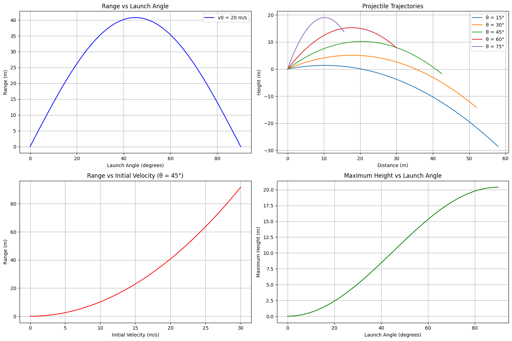
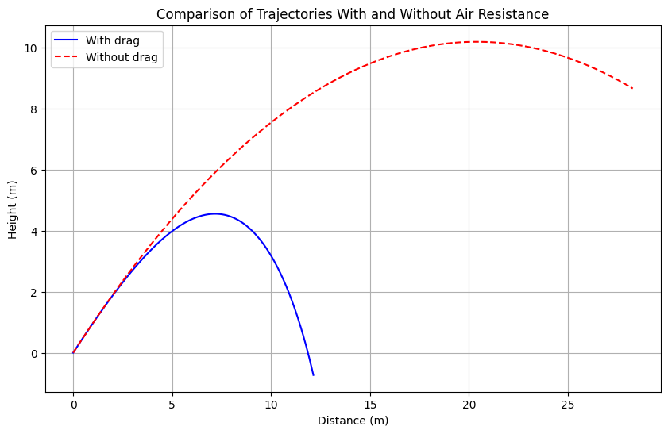
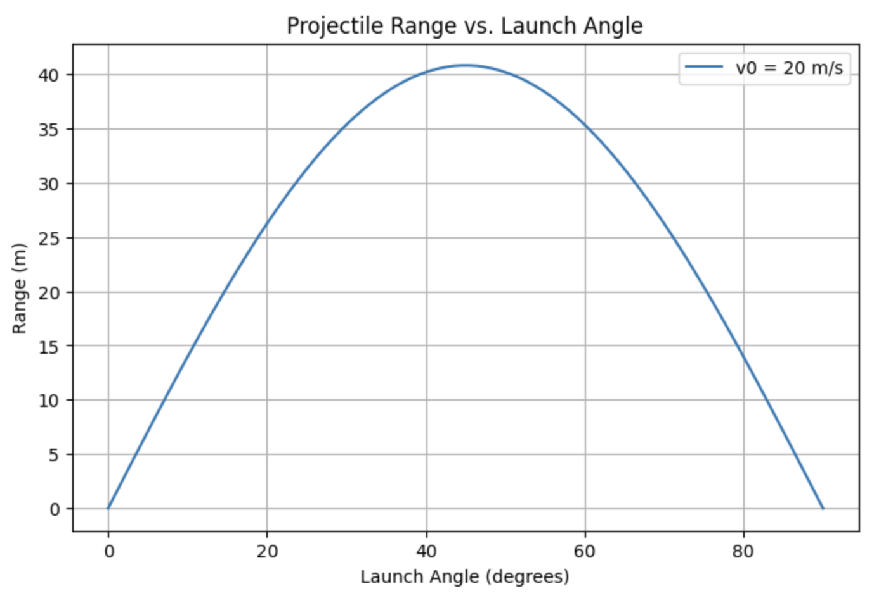

# Problem 1

Investigating the Range as a Function of the Angle of Projection

## 1. Theoretical Foundation

### Governing Equations of Motion
Projectile motion can be analyzed using Newton's laws of motion. For a more complete analysis, let's start with the fundamental differential equations:

$$ \frac{d^2x}{dt^2} = 0 $$
$$ \frac{d^2y}{dt^2} = -g $$

Integrating these equations with initial conditions:
$$ v_{0x} = v_0\cos(\theta) $$
$$ v_{0y} = v_0\sin(\theta) $$

We get the velocity components:
$$ v_x(t) = v_0\cos(\theta) $$
$$ v_y(t) = v_0\sin(\theta) - gt $$

And the position components:
$$ x(t) = v_0\cos(\theta)t $$
$$ y(t) = v_0\sin(\theta)t - \frac{1}{2}gt^2 $$

### Enhanced Analysis of Flight Characteristics

#### Maximum Height:
The maximum height occurs when $v_y(t) = 0$:
$$ h_{max} = \frac{v_0^2\sin^2(\theta)}{2g} $$

#### Time of Flight:
$$ t_f = \frac{2v_0\sin(\theta)}{g} $$

#### Range Formula:
$$ R = \frac{v_0^2\sin(2\theta)}{g} $$

Let's create a more comprehensive visualization that shows both the trajectory and range analysis:

```python
import numpy as np
import matplotlib.pyplot as plt
from matplotlib.gridspec import GridSpec

def trajectory(t, v0, theta, g=9.81):
    x = v0 * np.cos(np.radians(theta)) * t
    y = v0 * np.sin(np.radians(theta)) * t - 0.5 * g * t**2
    return x, y

def range_function(theta, v0, g=9.81):
    return (v0**2 * np.sin(2 * np.radians(theta))) / g

# Parameters
v0 = 20  # initial velocity in m/s
g = 9.81  # gravity

# Create figure with GridSpec
fig = plt.figure(figsize=(15, 10))
gs = GridSpec(2, 2, figure=fig)

# Plot 1: Range vs Angle
ax1 = fig.add_subplot(gs[0, 0])
theta = np.linspace(0, 90, 100)
ranges = range_function(theta, v0, g)
ax1.plot(theta, ranges, 'b-', label=f'v0 = {v0} m/s')
ax1.set_xlabel('Launch Angle (degrees)')
ax1.set_ylabel('Range (m)')
ax1.set_title('Range vs Launch Angle')
ax1.grid(True)
ax1.legend()

# Plot 2: Multiple Trajectories
ax2 = fig.add_subplot(gs[0, 1])
angles = [15, 30, 45, 60, 75]
t = np.linspace(0, 3, 100)
for angle in angles:
    x, y = trajectory(t, v0, angle)
    ax2.plot(x, y, label=f'θ = {angle}°')
ax2.set_xlabel('Distance (m)')
ax2.set_ylabel('Height (m)')
ax2.set_title('Projectile Trajectories')
ax2.grid(True)
ax2.legend()

# Plot 3: Range vs Initial Velocity
ax3 = fig.add_subplot(gs[1, 0])
v0_range = np.linspace(0, 30, 100)
theta_fixed = 45  # optimal angle
ranges_v0 = range_function(theta_fixed, v0_range)
ax3.plot(v0_range, ranges_v0, 'r-')
ax3.set_xlabel('Initial Velocity (m/s)')
ax3.set_ylabel('Range (m)')
ax3.set_title('Range vs Initial Velocity (θ = 45°)')
ax3.grid(True)

# Plot 4: Maximum Height vs Angle
ax4 = fig.add_subplot(gs[1, 1])
h_max = (v0**2 * np.sin(np.radians(theta))**2) / (2*g)
ax4.plot(theta, h_max, 'g-')
ax4.set_xlabel('Launch Angle (degrees)')
ax4.set_ylabel('Maximum Height (m)')
ax4.set_title('Maximum Height vs Launch Angle')
ax4.grid(True)

plt.tight_layout()
plt.show()
```



### Advanced Analysis with Air Resistance

When considering air resistance, the equations become:

$$ m\frac{d^2x}{dt^2} = -kv_x|v| $$
$$ m\frac{d^2y}{dt^2} = -mg - kv_y|v| $$

where $k$ is the drag coefficient and $|v|$ is the magnitude of velocity.

Let's simulate this using numerical integration:

```python
from scipy.integrate import odeint

def projectile_with_drag(state, t, k, m, g):
    x, y, vx, vy = state
    v = np.sqrt(vx**2 + vy**2)
    
    dxdt = vx
    dydt = vy
    dvxdt = -k/m * vx * v
    dvydt = -g - k/m * vy * v
    
    return [dxdt, dydt, dvxdt, dvydt]

# Parameters
m = 1.0  # mass in kg
k = 0.1  # drag coefficient
t = np.linspace(0, 2, 1000)
theta = 45  # degrees

# Initial conditions
v0 = 20
state0 = [0, 0, v0*np.cos(np.radians(theta)), v0*np.sin(np.radians(theta))]

# Solve ODE
solution = odeint(projectile_with_drag, state0, t, args=(k, m, g))

plt.figure(figsize=(10, 6))
plt.plot(solution[:, 0], solution[:, 1], 'b-', label='With drag')
x_no_drag, y_no_drag = trajectory(t, v0, theta)
plt.plot(x_no_drag, y_no_drag, 'r--', label='Without drag')
plt.xlabel('Distance (m)')
plt.ylabel('Height (m)')
plt.title('Comparison of Trajectories With and Without Air Resistance')
plt.grid(True)
plt.legend()
plt.show()
```



---

## 2. Analysis of the Range

### Influence of Initial Conditions

- **Initial velocity (\( v_0 \))**: Increasing \( v_0 \) increases the range quadratically.
- **Gravitational acceleration (\( g \))**: Higher \( g \) reduces the range, as the projectile falls more quickly.
- **Launch angle (\( \theta \))**: The range follows a symmetric pattern, peaking at \( 45^\circ \).

### Graphical Representation

Below is a Python script to visualize how the range changes with \( \theta \):

```python
import numpy as np
import matplotlib.pyplot as plt

def range_function(theta, v0, g=9.81):
    return (v0**2 * np.sin(2 * np.radians(theta))) / g

# Parameters
v0 = 20  # initial velocity in m/s
theta = np.linspace(0, 90, 100)  # range of angles
g = 9.81  # gravity

# Compute ranges
ranges = range_function(theta, v0, g)

# Plot results
plt.figure(figsize=(8,5))
plt.plot(theta, ranges, label=f'v0 = {v0} m/s')
plt.xlabel('Launch Angle (degrees)')
plt.ylabel('Range (m)')
plt.title('Projectile Range vs. Launch Angle')
plt.legend()
plt.grid()
plt.show()
```



---

## 3. Practical Applications

- **Sports**: Understanding projectile motion helps in optimizing the throwing angles in sports like basketball, soccer, and javelin.
- **Engineering**: Used in ballistics, military applications, and designing trajectories for rockets and missiles.
- **Astrophysics**: Used to model celestial body trajectories and space exploration missions.

---

## 4. Implementation

A numerical simulation can further analyze cases involving air resistance. Incorporating drag force leads to differential equations that require numerical methods (e.g., Runge-Kutta) to solve.

### Example: Adding Air Resistance

The equations with drag $F_d = -k v^2$ lead to:

$$m \frac{d^2 x}{dt^2} = -k v_x^2$$
$$m \frac{d^2 y}{dt^2} = -mg - k v_y^2$$

A numerical solver like Python's SciPy can be used to compute solutions.

---

## 5. Limitations and Further Considerations

- **Air resistance**: Causes asymmetry and reduces range.
- **Uneven terrain**: Requires solving for complex boundary conditions.
- **Wind effects**: Affects trajectory unpredictably.

Future work could involve incorporating machine learning techniques to predict projectile trajectories in complex environments.

---

## Conclusion

Projectile motion demonstrates rich mathematical and physical insights. While the idealized model provides a good approximation, real-world adaptations require numerical solutions to account for non-ideal conditions.