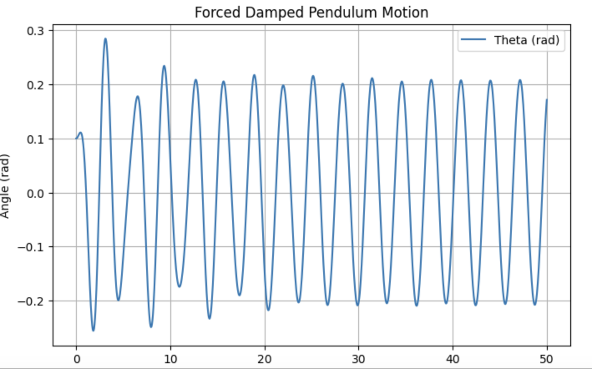

# Problem 2

Investigating the Dynamics of a Forced Damped Pendulum

## 1. Theoretical Foundation

### Governing Equation
The motion of a forced damped pendulum is governed by the nonlinear differential equation:

$$
\frac{d^2\theta}{dt^2} + b \frac{d\theta}{dt} + \frac{g}{L} \sin\theta = A \cos(\omega t)
$$

where:
- $\theta$ is the angular displacement,
- $b$ is the damping coefficient,
- $g$ is the acceleration due to gravity,
- $L$ is the length of the pendulum,
- $A$ is the amplitude of the external driving force,
- $\omega$ is the driving frequency.

### Approximate Solutions for Small Angles
For small angles (\( \theta \approx \sin \theta \)), the equation simplifies to:

$$
\frac{d^2\theta}{dt^2} + b \frac{d\theta}{dt} + \frac{g}{L} \theta = A \cos(\omega t)
$$

This corresponds to a damped, driven harmonic oscillator, which can be solved using standard methods. The steady-state solution takes the form:

$$
\theta(t) = \theta_0 e^{-bt/2} + C \cos(\omega t - \phi)
$$

where \( C \) and \( \phi \) depend on \( A, b, \omega \), and system parameters.

### Resonance Conditions
Resonance occurs when the driving frequency \( \omega \) is close to the natural frequency \( \omega_0 = \sqrt{g/L} \), leading to large oscillations. At resonance, energy transfer is maximized, which has practical implications in engineering and physics.

---

## 2. Analysis of Dynamics

### Influence of System Parameters

- **Damping Coefficient (\( b \))**: Higher damping suppresses oscillations and prevents chaotic motion.
- **Driving Amplitude (\( A \))**: Larger amplitudes can induce chaotic behavior and bifurcations.
- **Driving Frequency (\( \omega \))**: At specific values, resonance or chaos can emerge.

### Transition to Chaos

By varying \( A \) and \( \omega \), the system transitions from periodic oscillations to quasiperiodic and chaotic motion. These can be analyzed using:

- **Phase Diagrams**: Plots of \( \theta \) vs. \( d\theta/dt \) to visualize stability.
- **Poincaré Sections**: Discrete-time slices revealing periodicity or chaos.
- **Bifurcation Diagrams**: Showing system behavior changes as parameters vary.

---

## 3. Practical Applications

The forced damped pendulum model applies to various real-world systems:
- **Energy Harvesting Devices**: Used to optimize mechanical-to-electrical energy conversion.
- **Suspension Bridges**: Helps in understanding oscillations leading to structural failures.
- **Electrical Circuits**: Analogous to driven RLC circuits with damping and external forcing.

---

## 4. Implementation
Below is a Python script to simulate and visualize the forced damped pendulum.

```python
import numpy as np
import matplotlib.pyplot as plt
from scipy.integrate import solve_ivp

def forced_damped_pendulum(t, y, b, g, L, A, omega):
    theta, omega_dot = y
    dtheta_dt = omega_dot
    domega_dt = -b * omega_dot - (g/L) * np.sin(theta) + A * np.cos(omega * t)
    return [dtheta_dt, domega_dt]

# Parameters
b = 0.2  # damping coefficient
g = 9.81  # gravity (m/s^2)
L = 1.0  # pendulum length (m)
A = 1.2  # driving force amplitude
omega = 2.0  # driving frequency
y0 = [0.1, 0]  # initial conditions: [theta(0), omega(0)]
t_span = (0, 50)  # simulation time
t_eval = np.linspace(0, 50, 1000)  # time steps

# Solve ODE
sol = solve_ivp(forced_damped_pendulum, t_span, y0, t_eval=t_eval, args=(b, g, L, A, omega))

# Plot results
plt.figure(figsize=(8,5))
plt.plot(sol.t, sol.y[0], label='Theta (rad)')
plt.xlabel('Time (s)')
plt.ylabel('Angle (rad)')
plt.title('Forced Damped Pendulum Motion')
plt.legend()
plt.grid()
plt.show()
```

This script numerically solves the pendulum equation and plots \( \theta(t) \) over time.



---

## 5. Limitations and Extensions
- **Limitations**: Assumes a point mass pendulum, ignores friction and air resistance.
- **Extensions**: 
  - Nonlinear damping (e.g., air drag proportional to velocity squared).
  - Non-periodic driving forces to model irregular forcing.
  - Coupled pendulum systems for synchronization studies.

---

## 6. Conclusion
The forced damped pendulum demonstrates a wide range of behaviors, from simple harmonic motion to chaos. By adjusting damping, forcing, and frequency, we can explore resonance, stability, and chaotic dynamics, providing insights into both fundamental physics and engineering applications.