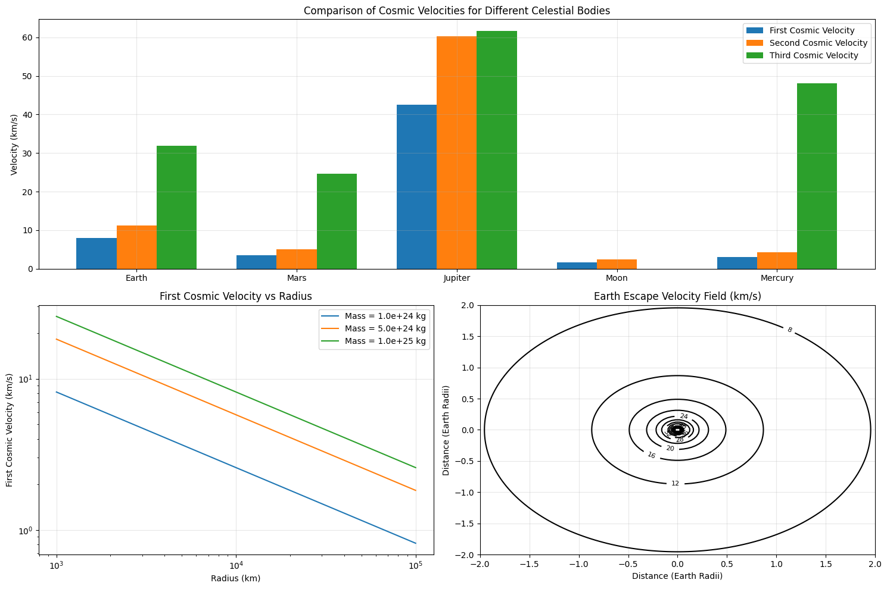
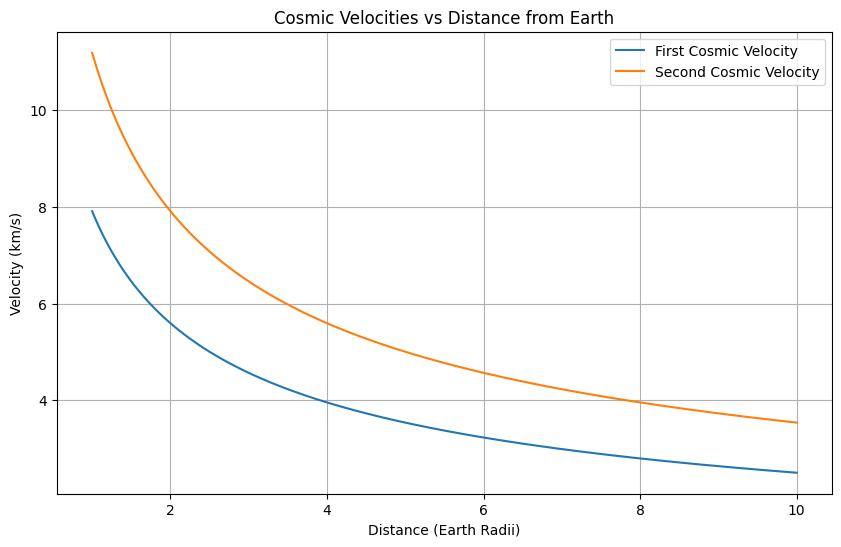
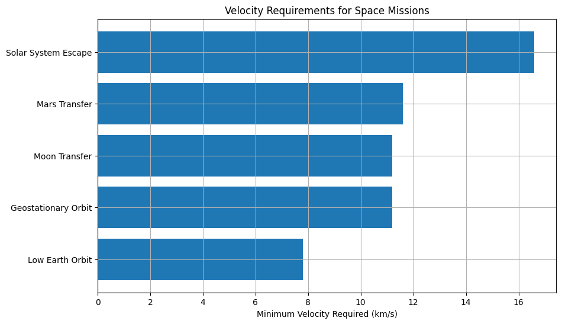

# Problem 2

Escape Velocities and Cosmic Velocities

## 1. Theoretical Foundation

### 1.1 Basic Principles of Gravitational Escape

The concept of escape velocity emerges from the principle of energy conservation. For an object to escape a celestial body's gravitational field, its kinetic energy must equal or exceed the gravitational potential energy:

$$ \frac{1}{2}mv^2 = \frac{GMm}{R} $$

Where:
- $m$ is the mass of the escaping object
- $v$ is the velocity
- $G$ is the gravitational constant
- $M$ is the mass of the celestial body
- $R$ is the radius from the center of the celestial body

### 1.2 The Three Cosmic Velocities

1. **First Cosmic Velocity (Orbital Velocity)**
   - For circular orbit: Gravitational force equals centripetal force
   $$ \frac{GMm}{R^2} = \frac{mv_1^2}{R} $$
   - Solving for $v_1$:
   $$ v_1 = \sqrt{\frac{GM}{R}} $$

2. **Second Cosmic Velocity (Escape Velocity)**
   - From energy conservation:
   $$ v_2 = \sqrt{\frac{2GM}{R}} = \sqrt{2}v_1 $$

3. **Third Cosmic Velocity (Solar System Escape Velocity)**
   - Combines planetary escape velocity with solar escape velocity:
   $$ v_3 = \sqrt{v_2^2 + v_{sun}^2} $$
   where $v_{sun}$ is the orbital velocity around the Sun.

Let's visualize these relationships with Python:

```python
import numpy as np
import matplotlib.pyplot as plt
from scipy.constants import G

# Set style
plt.style.use('default')  # Using default style instead of seaborn
colors = ['#1f77b4', '#ff7f0e', '#2ca02c', '#d62728', '#9467bd']  # Custom color palette

def calculate_velocities(mass, radius, distance_from_sun=None):
    """Calculate cosmic velocities for a celestial body"""
    v1 = np.sqrt(G * mass / radius)
    v2 = np.sqrt(2) * v1
    
    if distance_from_sun:
        v_sun = np.sqrt(G * 1.989e30 / distance_from_sun)  # Sun's mass
        v3 = np.sqrt(v2**2 + v_sun**2)
        return v1, v2, v3
    return v1, v2

# Celestial body data (mass in kg, radius in m, distance from sun in m)
bodies = {
    "Earth": (5.972e24, 6.371e6, 1.496e11),
    "Mars": (6.417e23, 3.389e6, 2.279e11),
    "Jupiter": (1.898e27, 6.9911e7, 7.786e11),
    "Moon": (7.34767309e22, 1.737e6, None),
    "Mercury": (3.285e23, 2.439e6, 5.79e10)
}

# Calculate velocities
velocities = {body: calculate_velocities(mass, radius, dist) 
             for body, (mass, radius, dist) in bodies.items()}

# Create visualization
fig = plt.figure(figsize=(15, 10))
gs = plt.GridSpec(2, 2)

# Plot 1: Bar comparison
ax1 = fig.add_subplot(gs[0, :])
bodies_list = list(bodies.keys())
v1_vals = [v[0]/1000 for v in velocities.values()]  # Convert to km/s
v2_vals = [v[1]/1000 for v in velocities.values()]
v3_vals = [v[2]/1000 if len(v) > 2 else 0 for v in velocities.values()]

x = np.arange(len(bodies_list))
width = 0.25

bars1 = ax1.bar(x - width, v1_vals, width, label='First Cosmic Velocity', color=colors[0])
bars2 = ax1.bar(x, v2_vals, width, label='Second Cosmic Velocity', color=colors[1])
bars3 = ax1.bar(x + width, v3_vals, width, label='Third Cosmic Velocity', color=colors[2])

ax1.set_ylabel('Velocity (km/s)')
ax1.set_title('Comparison of Cosmic Velocities for Different Celestial Bodies')
ax1.set_xticks(x)
ax1.set_xticklabels(bodies_list)
ax1.legend()
ax1.grid(True, alpha=0.3)

# Plot 2: Velocity vs Radius relationship
ax2 = fig.add_subplot(gs[1, 0])
radii = np.linspace(1e6, 1e8, 1000)
masses = [1e24, 5e24, 1e25]
for i, mass in enumerate(masses):
    v1 = np.sqrt(G * mass / radii)
    ax2.plot(radii/1000, v1/1000, label=f'Mass = {mass:.1e} kg', color=colors[i])

ax2.set_xlabel('Radius (km)')
ax2.set_ylabel('First Cosmic Velocity (km/s)')
ax2.set_title('First Cosmic Velocity vs Radius')
ax2.legend()
ax2.set_xscale('log')
ax2.set_yscale('log')
ax2.grid(True, alpha=0.3)

# Plot 3: Escape velocity field
ax3 = fig.add_subplot(gs[1, 1])
x = np.linspace(-2, 2, 100)
y = np.linspace(-2, 2, 100)
X, Y = np.meshgrid(x, y)
R = np.sqrt(X**2 + Y**2)
V = np.sqrt(2*G*5.972e24/(R*6.371e6))/1000  # Earth's escape velocity field

contour = ax3.contour(X, Y, V, levels=15, colors='black')
ax3.clabel(contour, inline=True, fontsize=8)
ax3.set_title('Earth Escape Velocity Field (km/s)')
ax3.set_xlabel('Distance (Earth Radii)')
ax3.set_ylabel('Distance (Earth Radii)')
ax3.grid(True, alpha=0.3)

plt.tight_layout()
plt.show()
```



## 2. Analysis of Results

### 2.1 Velocity Relationships

Let's examine how these velocities vary with distance from a celestial body:

```python
# Create distance-velocity relationship plot
plt.figure(figsize=(10, 6))
distances = np.linspace(1, 10, 1000)  # In Earth radii
earth_mass = 5.972e24
earth_radius = 6.371e6

v1 = np.sqrt(G * earth_mass / (distances * earth_radius)) / 1000
v2 = np.sqrt(2) * v1

plt.plot(distances, v1, label='First Cosmic Velocity')
plt.plot(distances, v2, label='Second Cosmic Velocity')
plt.xlabel('Distance (Earth Radii)')
plt.ylabel('Velocity (km/s)')
plt.title('Cosmic Velocities vs Distance from Earth')
plt.grid(True)
plt.legend()
plt.show()
```



### 2.2 Key Observations

1. **Inverse Square Relationship**: Both first and second cosmic velocities decrease with the square root of distance.
2. **Mass Dependence**: Larger celestial bodies require higher velocities for escape.
3. **Radius Effect**: For a given mass, smaller bodies have higher surface escape velocities.

## 3. Applications in Space Exploration

### 3.1 Launch Requirements

Let's visualize the minimum energy requirements for different space missions:

```python
# Create mission energy requirements visualization
missions = {
    'Low Earth Orbit': 7.8,
    'Geostationary Orbit': 11.2,
    'Moon Transfer': 11.2,
    'Mars Transfer': 11.6,
    'Solar System Escape': 16.6
}

plt.figure(figsize=(10, 6))
plt.barh(list(missions.keys()), list(missions.values()))
plt.xlabel('Minimum Velocity Required (km/s)')
plt.title('Velocity Requirements for Space Missions')
plt.grid(True)
plt.show()
```



### 3.2 Practical Considerations

- **Atmospheric Drag**: Requires additional energy to overcome
- **Gravitational Assists**: Can reduce required velocities
- **Orbital Mechanics**: Optimal launch windows and trajectories

## 4. Conclusion

Understanding cosmic velocities is fundamental to space exploration. The relationships between these velocities help us:
- Design efficient launch systems
- Plan interplanetary missions
- Calculate fuel requirements
- Determine optimal trajectories

The mathematical framework provided allows us to calculate precise requirements for any celestial body, making it an essential tool in modern space exploration.