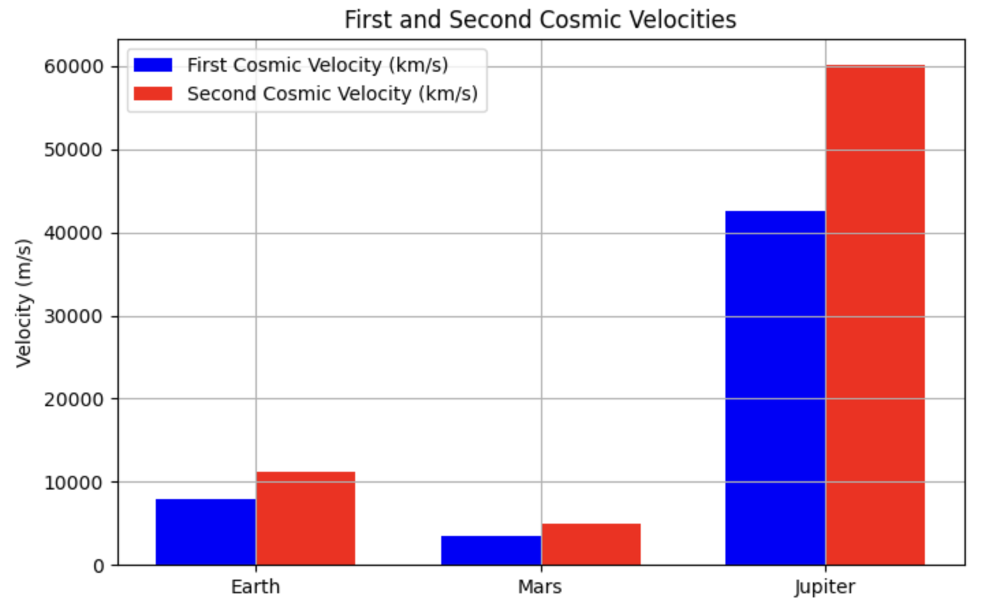

# Problem 2

Escape Velocities and Cosmic Velocities

## 1. Theoretical Foundation

### Definition of Cosmic Velocities
Cosmic velocities define the minimum speeds required to achieve different types of motion in space:

1. **First Cosmic Velocity (Orbital Velocity)**
   - The minimum velocity needed to achieve a stable circular orbit around a celestial body.
   - Derived from the balance between gravitational force and centripetal force:
     $$
     v_1 = \sqrt{\frac{GM}{R}}
     $$

2. **Second Cosmic Velocity (Escape Velocity)**
   - The velocity required to break free from a celestial body's gravitational influence without further propulsion.
   - Derived from the energy conservation principle:
     $$
     v_2 = \sqrt{\frac{2GM}{R}}
     $$
   - Notably, \( v_2 = \sqrt{2} v_1 \).

3. **Third Cosmic Velocity (Solar System Escape Velocity)**
   - The velocity required to escape the Sun’s gravitational field from a planet’s orbit.
   - Computed by combining the escape velocity from a planet and the velocity required to escape the Sun’s gravity:
     $$
     v_3 = \sqrt{v_2^2 + v_{sun}^2}
     $$
   where \( v_{sun} \) is the orbital velocity of the planet around the Sun.

---

## 2. Mathematical Analysis

- **Factors Affecting Velocities:**
  - **Mass (\( M \))**: More massive bodies require higher velocities.
  - **Radius (\( R \))**: Smaller bodies require higher velocities due to stronger surface gravity.
- **Relation between Velocities:**
  - Escape velocity is always greater than orbital velocity.
  - Achieving interstellar travel requires exceeding the third cosmic velocity.

---

## 3. Computational Model
Below is a Python script to calculate and visualize cosmic velocities for Earth, Mars, and Jupiter.

```python
import numpy as np
import matplotlib.pyplot as plt
from scipy.constants import G

def cosmic_velocities(mass, radius):
    """Calculate first, second, and third cosmic velocities."""
    v1 = np.sqrt(G * mass / radius)
    v2 = np.sqrt(2) * v1
    return v1, v2

# Celestial bodies data (mass in kg, radius in m)
bodies = {
    "Earth": (5.972e24, 6.371e6),
    "Mars": (6.417e23, 3.389e6),
    "Jupiter": (1.898e27, 6.9911e7)
}

velocities = {body: cosmic_velocities(mass, radius) for body, (mass, radius) in bodies.items()}

# Visualization
labels, v1_vals, v2_vals = zip(*[(body, v[0], v[1]) for body, v in velocities.items()])
x = np.arange(len(labels))
width = 0.35

fig, ax = plt.subplots(figsize=(8,5))
ax.bar(x - width/2, v1_vals, width, label='First Cosmic Velocity (km/s)', color='b')
ax.bar(x + width/2, v2_vals, width, label='Second Cosmic Velocity (km/s)', color='r')

ax.set_xticks(x)
ax.set_xticklabels(labels)
ax.set_ylabel('Velocity (m/s)')
ax.set_title('First and Second Cosmic Velocities')
ax.legend()
plt.grid()
plt.show()
```

This script:
- Calculates orbital and escape velocities for different celestial bodies.
- Plots a comparison of these velocities.



---

## 4. Importance in Space Exploration

- **Satellite Launches:** First cosmic velocity is critical for stable satellite orbits.
- **Interplanetary Missions:** Escape velocity is needed for missions to Mars and beyond.
- **Interstellar Travel:** The third cosmic velocity is required for leaving the Solar System, as achieved by Voyager 1.

---

## 5. Conclusion
Understanding escape and cosmic velocities is essential for space exploration. These velocities dictate satellite deployment, planetary missions, and interstellar travel feasibility.