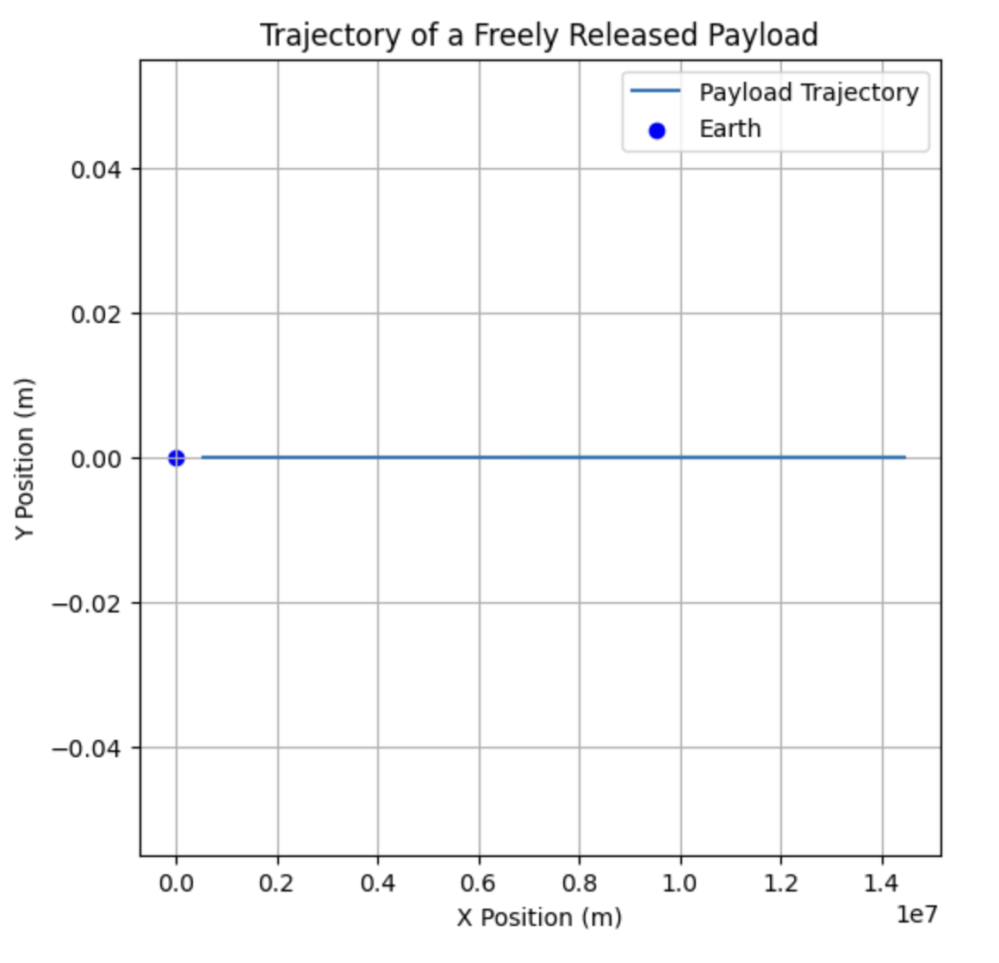

# Problem 3

Trajectories of a Freely Released Payload Near Earth

## 1. Theoretical Foundation

### Types of Possible Trajectories
The trajectory of a payload released near Earth depends on its initial velocity \( v \) relative to Earth's gravitational pull. The possible trajectories are:

1. **Suborbital (Parabolic Trajectory)**: If the payload does not reach orbital velocity, it follows a ballistic path back to Earth.
2. **Orbital (Elliptical Trajectory)**: If the velocity is between the first cosmic velocity \( v_1 \) (orbital velocity) and escape velocity \( v_2 \), the payload enters an elliptical orbit.
3. **Escape (Hyperbolic Trajectory)**: If the velocity exceeds escape velocity \( v_2 \), the payload follows a hyperbolic trajectory and escapes Earth's gravity.

These scenarios are governed by Newton's Law of Gravitation:
$$
F = \frac{GMm}{r^2}
$$
and Kepler’s Laws of Motion.

---

## 2. Mathematical Analysis

### Equations of Motion
The motion of the payload is governed by Newton’s Second Law:
$$
\frac{d^2\mathbf{r}}{dt^2} = -\frac{GM}{r^3} \mathbf{r}
$$

where:
- \( \mathbf{r} \) is the position vector,
- \( G \) is the gravitational constant,
- \( M \) is Earth’s mass.

Numerical integration (e.g., Runge-Kutta method) is used to solve these equations.

---

## 3. Computational Model
The following Python script simulates and visualizes the trajectory of a payload released near Earth.

```python
import numpy as np
import matplotlib.pyplot as plt
from scipy.integrate import solve_ivp

# Constants
G = 6.67430e-11  # Gravitational constant (m^3/kg/s^2)
M = 5.972e24     # Earth mass (kg)
R = 6.371e6      # Earth radius (m)

# Equations of motion
def equations(t, y):
    x, vx, y, vy = y
    r = np.sqrt(x**2 + y**2)
    ax = -G * M * x / r**3
    ay = -G * M * y / r**3
    return [vx, ax, vy, ay]

# Initial conditions (position in km, velocity in km/s)
x0, y0 = R + 500000, 0  # Initial altitude: 500 km
vx0, vy0 = 7.8e3, 0  # Initial velocity (near orbital velocity)
y_init = [x0, vx0, y0, vy0]

# Time span
t_span = (0, 10000)
t_eval = np.linspace(0, 10000, 1000)

# Solve ODE
sol = solve_ivp(equations, t_span, y_init, t_eval=t_eval, method='RK45')

# Plot trajectory
plt.figure(figsize=(6,6))
plt.plot(sol.y[0], sol.y[2], label='Payload Trajectory')
plt.scatter(0, 0, color='blue', label='Earth')
plt.xlabel('X Position (m)')
plt.ylabel('Y Position (m)')
plt.title('Trajectory of a Freely Released Payload')
plt.legend()
plt.grid()
plt.show()
```

This script:
- Defines gravitational equations of motion.
- Uses numerical integration to compute the trajectory.
- Plots the resulting trajectory.



---

## 4. Practical Applications

- **Satellite Deployment**: Ensuring correct initial conditions for stable orbits.
- **Reentry Scenarios**: Calculating reentry angles and speeds.
- **Escape Missions**: Planning interplanetary transfers.

---

## 5. Conclusion
Understanding the possible trajectories of a released payload is crucial for space missions. By analyzing the velocity and gravitational influence, we can determine whether an object will reenter, orbit, or escape Earth.