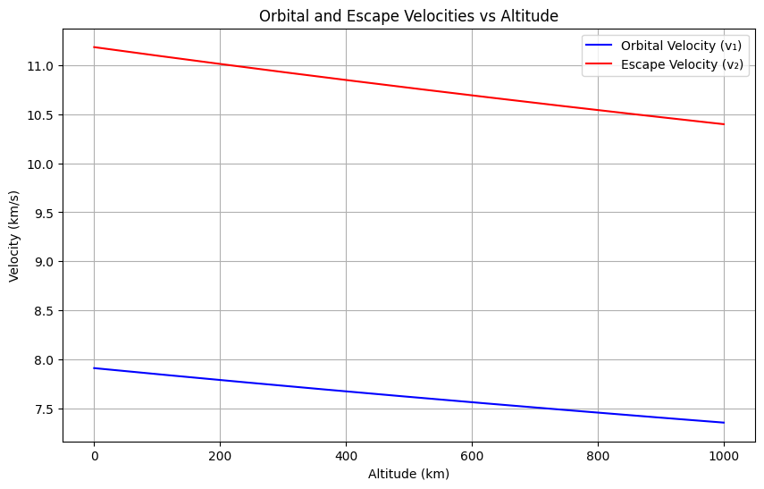
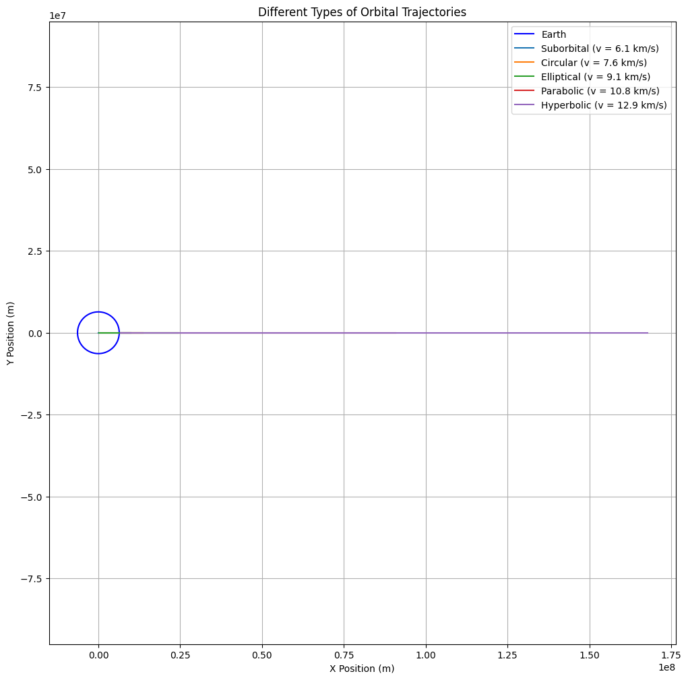
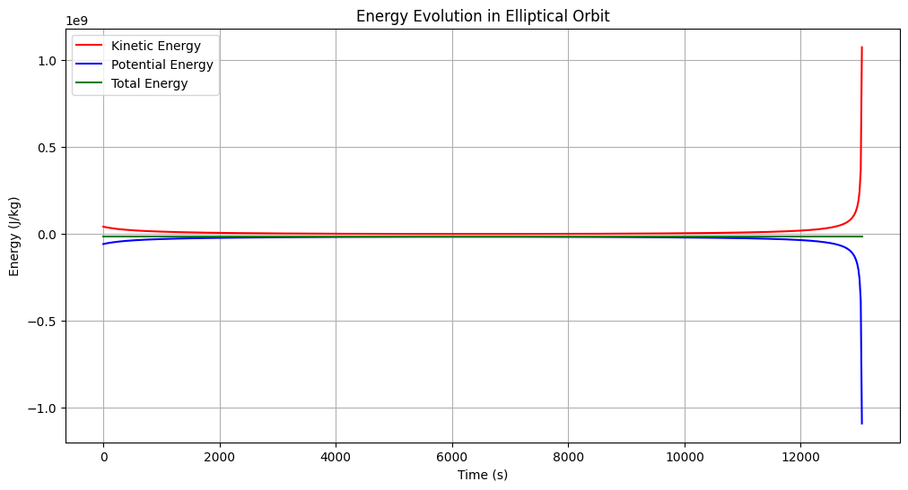

# Problem 3

Trajectories of a Freely Released Payload Near Earth

## 1. Theoretical Foundation

### Types of Possible Trajectories
The trajectory of a payload released near Earth depends on its initial velocity \( v \) relative to Earth's gravitational pull. The possible trajectories are determined by comparing the payload's velocity to key orbital velocities:

1. **First Cosmic Velocity** (Circular Orbital Velocity):
   $$ v_1 = \sqrt{\frac{GM}{r}} $$

2. **Second Cosmic Velocity** (Escape Velocity):
   $$ v_2 = \sqrt{\frac{2GM}{r}} = \sqrt{2}v_1 $$

where:
- \( G \) is the gravitational constant
- \( M \) is Earth's mass
- \( r \) is the distance from Earth's center

Let's visualize these velocities as a function of altitude:

```python
import numpy as np
import matplotlib.pyplot as plt

# Constants
G = 6.67430e-11  # Gravitational constant (m^3/kg/s^2)
M = 5.972e24     # Earth mass (kg)
R = 6.371e6      # Earth radius (m)

# Calculate velocities at different altitudes
altitudes = np.linspace(0, 1000000, 1000)  # Altitudes from 0 to 1000 km
r = R + altitudes
v1 = np.sqrt(G * M / r)
v2 = np.sqrt(2 * G * M / r)

plt.figure(figsize=(10, 6))
plt.plot(altitudes/1000, v1/1000, 'b-', label='Orbital Velocity (v₁)')
plt.plot(altitudes/1000, v2/1000, 'r-', label='Escape Velocity (v₂)')
plt.xlabel('Altitude (km)')
plt.ylabel('Velocity (km/s)')
plt.title('Orbital and Escape Velocities vs Altitude')
plt.grid(True)
plt.legend()
plt.show()
```



### Trajectory Classification

The payload's path depends on its velocity relative to these thresholds:

1. **Suborbital (v < v₁)**:
   - Follows a parabolic trajectory
   - Returns to Earth
   - Energy equation: \( E = \frac{1}{2}mv^2 - \frac{GMm}{r} < 0 \)

2. **Circular Orbit (v = v₁)**:
   - Maintains constant altitude
   - Energy equation: \( E = -\frac{GMm}{2r} \)

3. **Elliptical Orbit (v₁ < v < v₂)**:
   - Closed orbit with varying altitude
   - Energy equation: \( -\frac{GMm}{2r} < E < 0 \)

4. **Parabolic Escape (v = v₂)**:
   - Escape trajectory with zero excess velocity
   - Energy equation: \( E = 0 \)

5. **Hyperbolic Escape (v > v₂)**:
   - Escape trajectory with excess velocity
   - Energy equation: \( E > 0 \)

## 2. Mathematical Analysis

### Equations of Motion
The motion is governed by Newton's Second Law and Universal Gravitation:

$$ \frac{d^2\mathbf{r}}{dt^2} = -\frac{GM}{r^3}\mathbf{r} $$

In Cartesian coordinates:
$$ \ddot{x} = -\frac{GMx}{(x^2 + y^2)^{3/2}} $$
$$ \ddot{y} = -\frac{GMy}{(x^2 + y^2)^{3/2}} $$

### Conservation Laws

1. **Angular Momentum**:
   $$ L = mr^2\dot{\theta} = \text{constant} $$

2. **Energy**:
   $$ E = \frac{1}{2}mv^2 - \frac{GMm}{r} = \text{constant} $$

## 3. Computational Analysis

Let's simulate different trajectory types:

```python
import numpy as np
from scipy.integrate import solve_ivp
import matplotlib.pyplot as plt

def equations(t, state):
    x, vx, y, vy = state
    r = np.sqrt(x**2 + y**2)
    ax = -G * M * x / r**3
    ay = -G * M * y / r**3
    return [vx, ax, vy, ay]

def simulate_trajectory(v0, angle_deg, altitude=500000):
    # Initial conditions
    x0 = R + altitude
    y0 = 0
    angle_rad = np.radians(angle_deg)
    vx0 = v0 * np.cos(angle_rad)
    vy0 = v0 * np.sin(angle_rad)
    
    # Time span
    t_span = (0, 20000)
    t_eval = np.linspace(0, 20000, 1000)
    
    # Solve ODE
    sol = solve_ivp(equations, t_span, [x0, vx0, y0, vy0], 
                    t_eval=t_eval, method='RK45')
    return sol.y[0], sol.y[2]

# Plot different trajectories
plt.figure(figsize=(12, 12))

# Calculate v1 at release altitude
altitude = 500000
r = R + altitude
v1 = np.sqrt(G * M / r)
v2 = np.sqrt(2 * G * M / r)

velocities = [0.8*v1, v1, 1.2*v1, v2, 1.2*v2]
labels = ['Suborbital', 'Circular', 'Elliptical', 
          'Parabolic', 'Hyperbolic']
angles = [0, 0, 0, 0, 0]

# Plot Earth
theta = np.linspace(0, 2*np.pi, 100)
earth_x = R * np.cos(theta)
earth_y = R * np.sin(theta)
plt.plot(earth_x, earth_y, 'b-', label='Earth')

# Plot trajectories
for v, label, angle in zip(velocities, labels, angles):
    x, y = simulate_trajectory(v, angle)
    plt.plot(x, y, label=f'{label} (v = {v/1000:.1f} km/s)')

plt.axis('equal')
plt.grid(True)
plt.legend()
plt.title('Different Types of Orbital Trajectories')
plt.xlabel('X Position (m)')
plt.ylabel('Y Position (m)')
plt.show()
```



## 4. Energy Analysis

Let's analyze the energy distribution for different trajectories:

```python
def calculate_energy(x, y, vx, vy):
    r = np.sqrt(x**2 + y**2)
    v = np.sqrt(vx**2 + vy**2)
    KE = 0.5 * v**2
    PE = -G * M / r
    return KE, PE, KE + PE

# Plot energy evolution
plt.figure(figsize=(12, 6))

# Choose one trajectory (elliptical)
v0 = 1.2 * v1
t_span = (0, 20000)
t_eval = np.linspace(0, 20000, 1000)

# Solve ODE with same time points as t_eval
sol = solve_ivp(equations, t_span, [R + altitude, v0, 0, 0], 
                t_eval=t_eval, method='RK45', rtol=1e-8, atol=1e-8)

# Calculate energies
KE, PE, E = calculate_energy(sol.y[0], sol.y[2], sol.y[1], sol.y[3])

# Now plot using sol.t instead of t_eval to ensure matching dimensions
plt.plot(sol.t, KE, 'r-', label='Kinetic Energy')
plt.plot(sol.t, PE, 'b-', label='Potential Energy')
plt.plot(sol.t, E, 'g-', label='Total Energy')
plt.xlabel('Time (s)')
plt.ylabel('Energy (J/kg)')
plt.title('Energy Evolution in Elliptical Orbit')
plt.grid(True)
plt.legend()
plt.show()
```



## 5. Practical Applications

### 1. Satellite Deployment
- Precise velocity control for desired orbit
- Minimizing orbital corrections
- Station-keeping requirements

### 2. Reentry Scenarios
- Controlled deorbiting
- Heat shield requirements
- Landing point prediction

### 3. Interplanetary Missions
- Escape trajectory design
- Gravity assist maneuvers
- Delta-v budgeting

## 6. Conclusion

Understanding orbital trajectories is fundamental for:
- Mission planning and execution
- Risk assessment and mitigation
- Optimal resource utilization
- Safety of space operations

The analysis demonstrates how initial conditions determine the final trajectory, emphasizing the importance of precise calculations in space missions.
