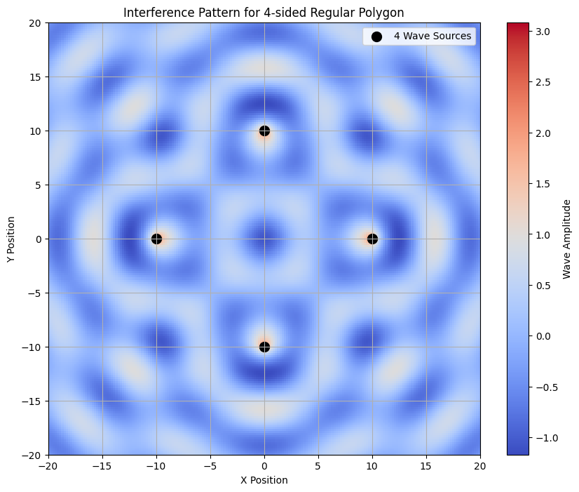

# Problem 1

Interference Patterns on a Water Surface

## 1. Theoretical Foundation

### 1.1 Single Wave Source
A circular wave from a point source creates ripples that spread outward. The displacement η(x, y, t) at any point is given by:

$$ \eta(x, y, t) = \frac{A}{\sqrt{r}} \cdot \cos(kr - \omega t + \phi) $$

where:
- A: wave amplitude
- r: distance from source = $\sqrt{(x - x_0)^2 + (y - y_0)^2}$
- k: wave number = $\frac{2\pi}{\lambda}$
- ω: angular frequency = 2πf
- φ: initial phase

Let's first visualize a single wave source:

```python
import numpy as np
import matplotlib.pyplot as plt

def single_wave(X, Y, source, t=0, A=1, k=1, omega=2*np.pi):
    x0, y0 = source
    r = np.sqrt((X - x0)**2 + (Y - y0)**2)
    return A/np.sqrt(r + 1e-6) * np.cos(k*r - omega*t)

# Create grid
x = np.linspace(-20, 20, 200)
y = np.linspace(-20, 20, 200)
X, Y = np.meshgrid(x, y)

# Single source at origin
source = (0, 0)
wave = single_wave(X, Y, source)

plt.figure(figsize=(8, 6))
plt.imshow(wave, extent=[-20, 20, -20, 20], cmap='coolwarm', origin='lower')
plt.colorbar(label='Wave Amplitude')
plt.scatter(*source, color='black', s=100, label='Wave Source')
plt.title('Single Circular Wave Source')
plt.xlabel('X Position')
plt.ylabel('Y Position')
plt.legend()
plt.show()
```


### 1.2 Multiple Wave Sources
For N sources, the total displacement follows the superposition principle:

$$ \eta_{total}(x, y, t) = \sum_{i=1}^{N} \frac{A}{\sqrt{r_i}} \cos(kr_i - \omega t + \phi_i) $$

where $r_i$ is the distance from the i-th source.

## 2. Implementation for Regular Polygons

### 2.1 Source Placement
We'll place sources at vertices of regular polygons. For an N-sided polygon:

$$ x_i = R\cos(2\pi i/N) $$
$$ y_i = R\sin(2\pi i/N) $$

where R is the radius of the circumscribed circle.

Let's create a function to generate and visualize interference patterns:

```python
def create_polygon_sources(N, radius):
    angles = np.linspace(0, 2*np.pi, N, endpoint=False)
    return [(radius*np.cos(a), radius*np.sin(a)) for a in angles]

def plot_interference(N, radius=10, size=40, resolution=200):
    # Setup grid
    x = np.linspace(-size/2, size/2, resolution)
    y = np.linspace(-size/2, size/2, resolution)
    X, Y = np.meshgrid(x, y)
    
    # Create sources
    sources = create_polygon_sources(N, radius)
    
    # Calculate interference
    total_wave = np.zeros_like(X)
    for source in sources:
        total_wave += single_wave(X, Y, source)
    
    # Plot
    plt.figure(figsize=(10, 8))
    plt.imshow(total_wave, extent=[-size/2, size/2, -size/2, size/2], 
               cmap='coolwarm', origin='lower')
    plt.colorbar(label='Wave Amplitude')
    
    # Plot sources
    sources_x, sources_y = zip(*sources)
    plt.scatter(sources_x, sources_y, color='black', s=100, 
               label=f'{N} Wave Sources')
    
    plt.title(f'Interference Pattern for {N}-sided Regular Polygon')
    plt.xlabel('X Position')
    plt.ylabel('Y Position')
    plt.legend()
    plt.grid(True)
    plt.show()

# Visualize patterns for different polygons
for N in [3, 4, 5]:
    plot_interference(N)
```





### 2.2 Analysis of Symmetry

Let's analyze how the interference pattern changes with time:

```python
def animate_interference(N, frames=4):
    fig, axes = plt.subplots(1, frames, figsize=(20, 5))
    times = np.linspace(0, 2*np.pi, frames)
    
    x = np.linspace(-20, 20, 200)
    y = np.linspace(-20, 20, 200)
    X, Y = np.meshgrid(x, y)
    sources = create_polygon_sources(N, 10)
    
    for i, t in enumerate(times):
        total_wave = np.zeros_like(X)
        for source in sources:
            total_wave += single_wave(X, Y, source, t=t)
            
        im = axes[i].imshow(total_wave, extent=[-20, 20, -20, 20], 
                           cmap='coolwarm', origin='lower')
        axes[i].scatter(*zip(*sources), color='black', s=50)
        axes[i].set_title(f't = {t:.1f}')
        plt.colorbar(im, ax=axes[i])
    
    plt.suptitle(f'Time Evolution of {N}-sided Polygon Interference Pattern')
    plt.tight_layout()
    plt.show()

animate_interference(4)
```


## 3. Analysis of Results

### 3.1 Constructive Interference
Constructive interference occurs when waves are in phase:

$$ |r_1 - r_2| = n\lambda $$

where n is an integer and λ is the wavelength.

### 3.2 Destructive Interference
Destructive interference occurs when waves are out of phase:

$$ |r_1 - r_2| = (n + \frac{1}{2})\lambda $$

Let's visualize the interference intensity:

```python
def plot_intensity(N, radius=10):
    x = np.linspace(-20, 20, 200)
    y = np.linspace(-20, 20, 200)
    X, Y = np.meshgrid(x, y)
    sources = create_polygon_sources(N, radius)
    
    total_wave = np.zeros_like(X)
    for source in sources:
        total_wave += single_wave(X, Y, source)
    
    intensity = total_wave**2
    
    plt.figure(figsize=(10, 8))
    plt.imshow(intensity, extent=[-20, 20, -20, 20], 
               cmap='viridis', origin='lower')
    plt.colorbar(label='Intensity')
    plt.scatter(*zip(*sources), color='white', s=100)
    plt.title(f'Wave Intensity Pattern ({N}-sided Polygon)')
    plt.xlabel('X Position')
    plt.ylabel('Y Position')
    plt.show()

plot_intensity(4)
```


## 4. Conclusions

1. **Symmetry**: The interference pattern reflects the symmetry of the source polygon.
2. **Nodal Lines**: Clear lines of destructive interference form geometric patterns.
3. **Central Maxima**: Strong constructive interference occurs at the center due to equal path lengths.

## 5. Applications

- Acoustic design in concert halls
- Antenna array design
- Optical interferometry
- Water wave energy focusing

The study of interference patterns helps us understand wave behavior in various fields, from acoustics to electromagnetic theory.
