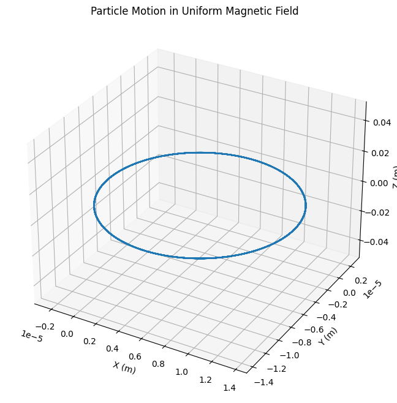
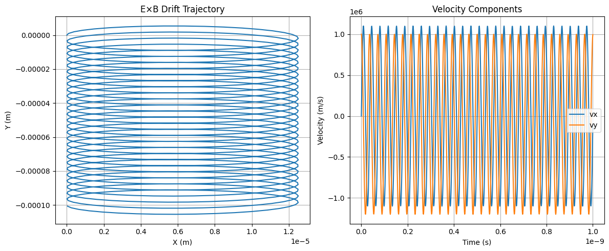
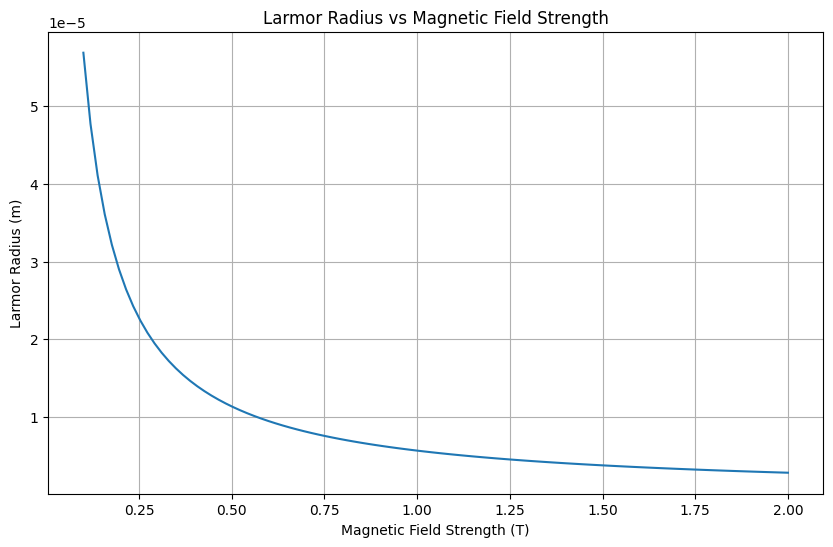
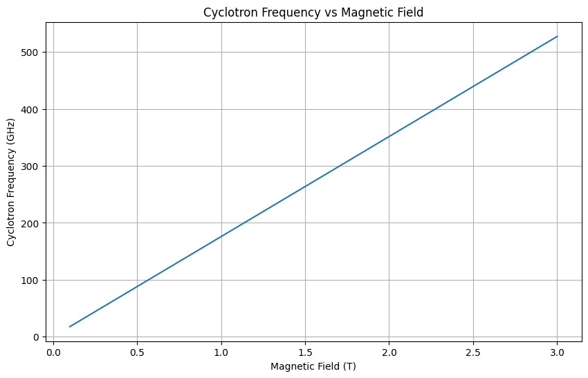
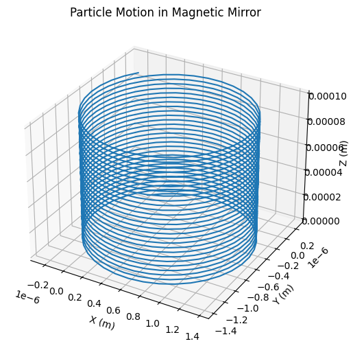

# Problem 1

Investigating Charged Particle Motion under Electromagnetic Fields

## 1. Theoretical Foundation

### Governing Equations
The motion of charged particles in electromagnetic fields is governed by the Lorentz force:

$$ \mathbf{F} = q\mathbf{E} + q\mathbf{v} \times \mathbf{B} $$

Using Newton's second law:

$$ m\frac{d\mathbf{v}}{dt} = q\mathbf{E} + q\mathbf{v} \times \mathbf{B} $$

In component form for 3D motion:

$$ m\frac{dv_x}{dt} = qE_x + q(v_yB_z - v_zB_y) $$
$$ m\frac{dv_y}{dt} = qE_y + q(v_zB_x - v_xB_z) $$
$$ m\frac{dv_z}{dt} = qE_z + q(v_xB_y - v_yB_x) $$

### Key Parameters

1. **Cyclotron Frequency:**
$$ \omega_c = \frac{qB}{m} $$

2. **Larmor Radius:**
$$ r_L = \frac{mv_\perp}{qB} $$

3. **E×B Drift Velocity:**
$$ \mathbf{v}_d = \frac{\mathbf{E} \times \mathbf{B}}{B^2} $$

Let's simulate these motions using Python:

```python
import numpy as np
import matplotlib.pyplot as plt
from mpl_toolkits.mplot3d import Axes3D
from scipy.integrate import odeint

def lorentz_force(state, t, q, m, E, B):
    x, y, z, vx, vy, vz = state
    
    # Force components
    dvx_dt = (q/m) * (E[0] + vy*B[2] - vz*B[1])
    dvy_dt = (q/m) * (E[1] + vz*B[0] - vx*B[2])
    dvz_dt = (q/m) * (E[2] + vx*B[1] - vy*B[0])
    
    return [vx, vy, vz, dvx_dt, dvy_dt, dvz_dt]

# Parameters
q = 1.6e-19  # electron charge
m = 9.1e-31  # electron mass
t = np.linspace(0, 1e-9, 1000)

# Case 1: Uniform Magnetic Field
B = [0, 0, 1.0]  # Tesla
E = [0, 0, 0]    # V/m
initial_state = [0, 0, 0, 1e6, 1e6, 0]  # Initial position and velocity

solution = odeint(lorentz_force, initial_state, t, args=(q, m, E, B))

# Plot trajectory
fig = plt.figure(figsize=(10, 8))
ax = fig.add_subplot(111, projection='3d')
ax.plot(solution[:, 0], solution[:, 1], solution[:, 2])
ax.set_xlabel('X (m)')
ax.set_ylabel('Y (m)')
ax.set_zlabel('Z (m)')
ax.set_title('Particle Motion in Uniform Magnetic Field')
plt.show()
```



### Analysis of Different Field Configurations

Let's examine the E×B drift:

```python
# Case 2: Crossed E and B fields
E = [1e5, 0, 0]  # V/m
B = [0, 0, 1.0]  # Tesla
initial_state = [0, 0, 0, 0, 1e6, 0]

solution_ExB = odeint(lorentz_force, initial_state, t, args=(q, m, E, B))

# Plot E×B drift
plt.figure(figsize=(12, 5))
plt.subplot(121)
plt.plot(solution_ExB[:, 0], solution_ExB[:, 1])
plt.xlabel('X (m)')
plt.ylabel('Y (m)')
plt.title('E×B Drift Trajectory')
plt.grid(True)

# Plot velocity components
plt.subplot(122)
plt.plot(t, solution_ExB[:, 3], label='vx')
plt.plot(t, solution_ExB[:, 4], label='vy')
plt.xlabel('Time (s)')
plt.ylabel('Velocity (m/s)')
plt.title('Velocity Components')
plt.legend()
plt.grid(True)
plt.tight_layout()
plt.show()
```



## 2. Parameter Study

Let's investigate how the Larmor radius changes with magnetic field strength:

```python
def larmor_radius(v_perp, B, q, m):
    return m * v_perp / (q * B)

B_values = np.linspace(0.1, 2.0, 100)
v_perp = 1e6
radii = [larmor_radius(v_perp, B, q, m) for B in B_values]

plt.figure(figsize=(10, 6))
plt.plot(B_values, radii)
plt.xlabel('Magnetic Field Strength (T)')
plt.ylabel('Larmor Radius (m)')
plt.title('Larmor Radius vs Magnetic Field Strength')
plt.grid(True)
plt.show()
```



## 3. Applications

### Cyclotron Operation

The cyclotron frequency determines particle acceleration:

```python
def cyclotron_freq(B, q, m):
    return q * B / m

B_range = np.linspace(0.1, 3.0, 100)
frequencies = [cyclotron_freq(B, q, m) for B in B_range]

plt.figure(figsize=(10, 6))
plt.plot(B_range, np.array(frequencies)/1e9)  # Convert to GHz
plt.xlabel('Magnetic Field (T)')
plt.ylabel('Cyclotron Frequency (GHz)')
plt.title('Cyclotron Frequency vs Magnetic Field')
plt.grid(True)
plt.show()
```



## 4. Advanced Analysis: Non-uniform Fields

For non-uniform magnetic fields, we can model magnetic mirrors:

```python
def magnetic_mirror(state, t, q, m):
    x, y, z, vx, vy, vz = state
    B = [0, 0, 1.0 + 0.1*z**2]  # Non-uniform B field
    E = [0, 0, 0]
    
    return lorentz_force(state, t, q, m, E, B)

initial_state = [0, 0, 0, 1e5, 1e5, 1e5]
solution_mirror = odeint(magnetic_mirror, initial_state, t, args=(q, m))

fig = plt.figure(figsize=(12, 6))
ax = fig.add_subplot(111, projection='3d')
ax.plot(solution_mirror[:, 0], solution_mirror[:, 1], solution_mirror[:, 2])
ax.set_xlabel('X (m)')
ax.set_ylabel('Y (m)')
ax.set_zlabel('Z (m)')
ax.set_title('Particle Motion in Magnetic Mirror')
plt.show()
```



## 5. Practical Applications

### Particle Accelerators
- Cyclotrons
- Synchrotrons 
- Linear accelerators

### Plasma Confinement
- Tokamaks
- Magnetic mirrors
- Stellarators

### Scientific Instruments
- Mass spectrometers
- Electron microscopes
- Beta-ray spectrometers

## Conclusion

The Lorentz force provides a fundamental mechanism for controlling charged particle motion. Through simulation, we've demonstrated various configurations and their applications in modern physics and technology. The interplay between electric and magnetic fields offers rich possibilities for particle manipulation and confinement.

## Future Extensions

1. Include relativistic effects for high-speed particles
2. Add collision effects and particle interactions
3. Simulate more complex field geometries
4. Include quantum effects for very low energies
