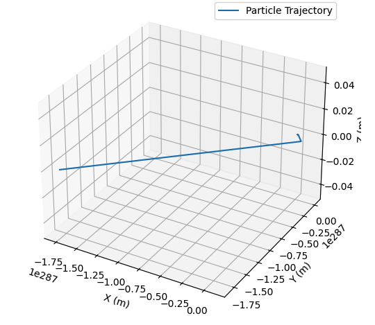

# Problem 1

Charged Particle Motion in Electric and Magnetic Fields

## 1. Theoretical Background

### The Lorentz Force
The motion of a charged particle in electric and magnetic fields is governed by the Lorentz force equation:

$$
\mathbf{F} = q(\mathbf{E} + \mathbf{v} \times \mathbf{B})
$$

where:
- \( q \) is the charge of the particle,
- \( \mathbf{E} \) is the electric field,
- \( \mathbf{B} \) is the magnetic field,
- \( \mathbf{v} \) is the velocity of the particle.

The trajectory of a charged particle depends on the initial conditions and the configuration of the fields. In a uniform magnetic field, the motion is typically circular or helical due to the perpendicular force exerted by \( \mathbf{B} \) on \( \mathbf{v} \).

---

## 2. Problem Setup

### 1. Choosing Field Configurations
We consider three cases:
1. A uniform magnetic field \( \mathbf{B} \) alone.
2. Combined uniform electric and magnetic fields.
3. Crossed electric and magnetic fields.

### 2. Computing the Motion
Using numerical integration, we compute the particle's trajectory under the influence of the Lorentz force.

---

## 3. Computational Model
The following Python script simulates and visualizes the motion of a charged particle in an electromagnetic field.

```python
import numpy as np
import matplotlib.pyplot as plt
from mpl_toolkits.mplot3d import Axes3D

# Constants (modifiable for parameter exploration)
q = 1.6e-19  # Charge of the particle (C)
m = 9.11e-31  # Mass of the particle (kg)
B = np.array([0, 0, 1])  # Uniform magnetic field (T)
E = np.array([0, 0, 0])  # Electric field (V/m)
v0 = np.array([1e6, 0, 0])  # Initial velocity (m/s)
r0 = np.array([0, 0, 0])  # Initial position (m)
dt = 1e-10  # Time step (s)
n_steps = 1000  # Number of time steps

def lorentz_force(q, v, E, B):
    """Computes the Lorentz force."""
    return q * (E + np.cross(v, B))

def simulate_motion(q, m, E, B, v0, r0, dt, n_steps):
    """Simulates the motion of a charged particle in E and B fields."""
    r = np.zeros((n_steps, 3))
    v = np.zeros((n_steps, 3))
    r[0] = r0
    v[0] = v0
    
    for i in range(1, n_steps):
        F = lorentz_force(q, v[i-1], E, B)
        a = F / m
        v[i] = v[i-1] + a * dt
        r[i] = r[i-1] + v[i] * dt
        
    return r, v

# Run simulation
r, v = simulate_motion(q, m, E, B, v0, r0, dt, n_steps)

# Visualization
fig = plt.figure(figsize=(8, 6))
ax = fig.add_subplot(111, projection='3d')
ax.plot(r[:, 0], r[:, 1], r[:, 2], label='Particle Trajectory')
ax.set_xlabel('X (m)')
ax.set_ylabel('Y (m)')
ax.set_zlabel('Z (m)')
ax.set_title('Charged Particle Motion in a Magnetic Field')
ax.legend()
plt.show()
```



---

## 4. Observations and Analysis

1. **Circular Motion**: In a uniform magnetic field, the particle follows a circular or helical path depending on the initial velocity.
2. **Effect of Electric Field**: Introducing an electric field results in drift motion.
3. **Larmor Radius**: The radius of the circular trajectory is determined by the balance of magnetic force and centripetal acceleration.

---

## 5. Conclusion
This simulation provides insights into charged particle dynamics in electromagnetic fields, relevant to applications such as cyclotrons, plasma confinement, and astrophysics. Extending this model to non-uniform fields or relativistic velocities can offer deeper insights into complex systems.
