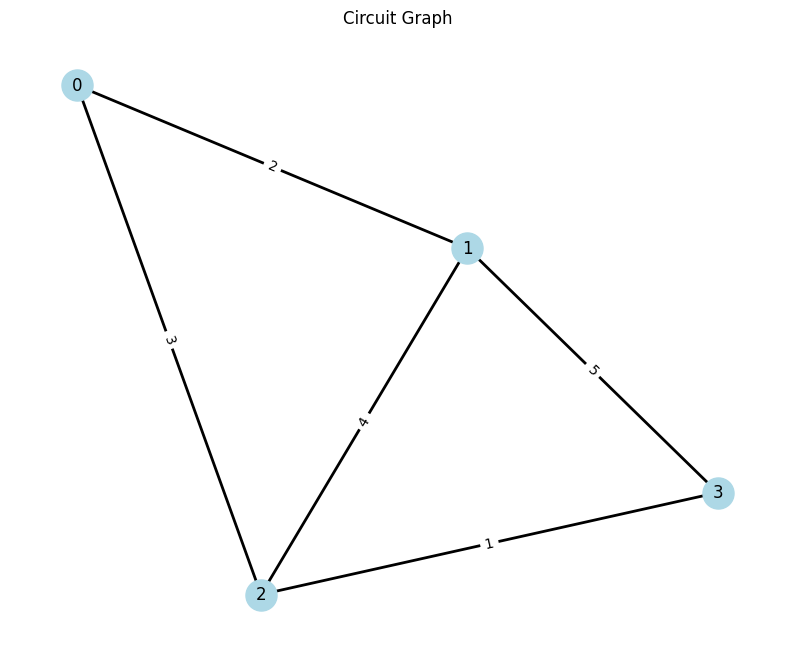
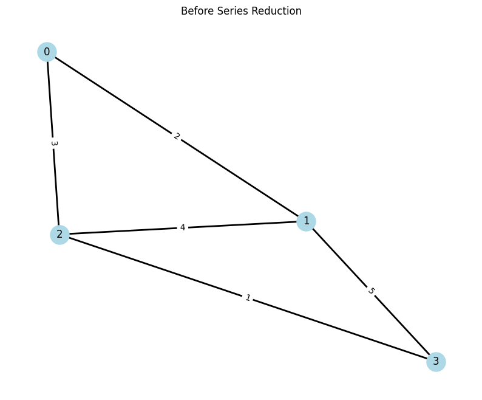
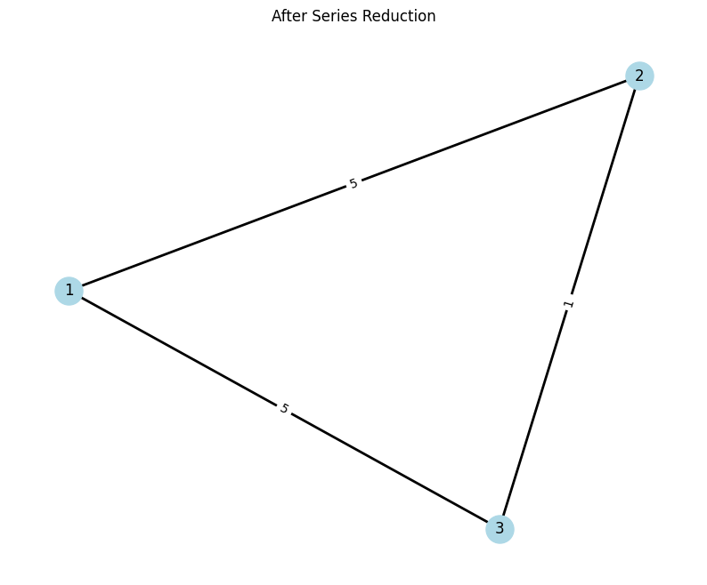
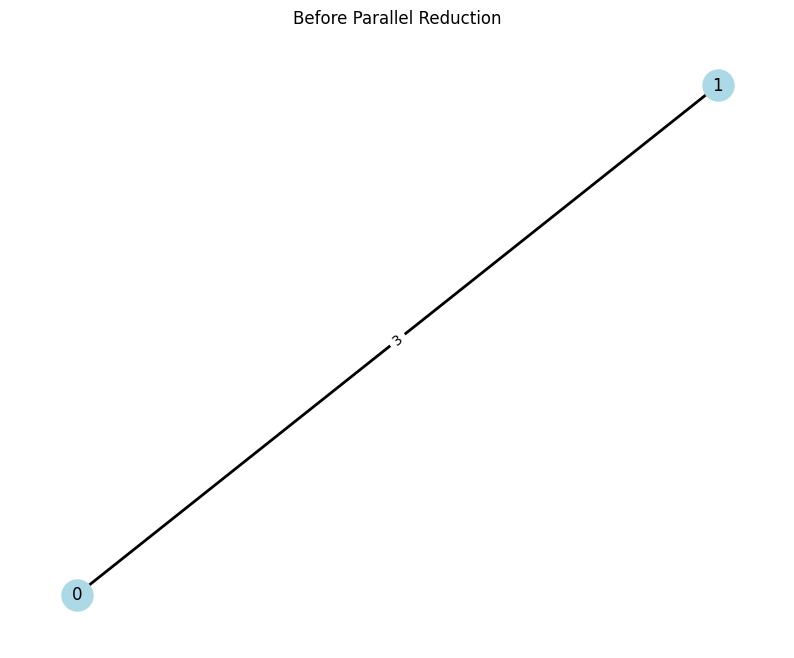
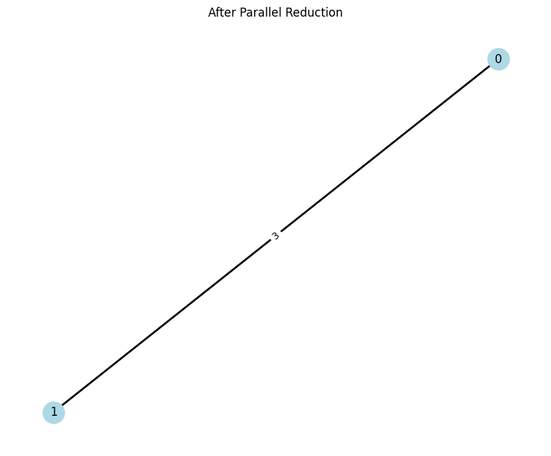
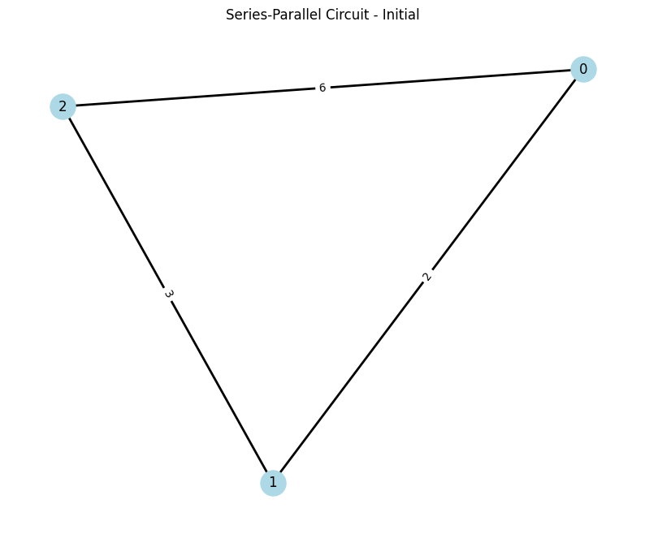
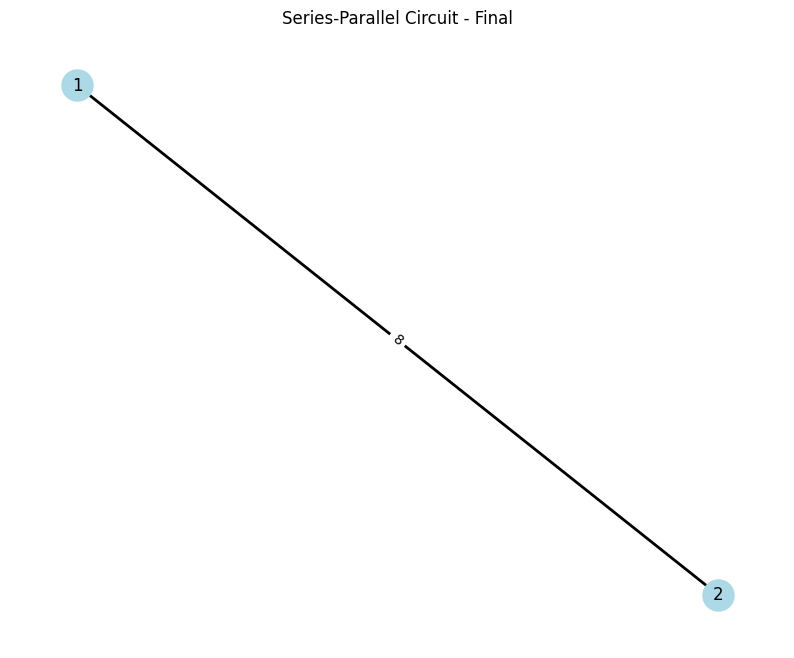

# Problem 1

Equivalent Resistance Using Graph Theory

## 1. Theoretical Foundation

### 1.1 Basic Circuit Laws
For resistors in series and parallel, the equivalent resistance is given by:

Series: $$ R_{eq} = \sum_{i=1}^n R_i $$

Parallel: $$ \frac{1}{R_{eq}} = \sum_{i=1}^n \frac{1}{R_i} $$

### 1.2 Graph Representation
A circuit can be represented as a weighted undirected graph G(V,E) where:
- V: vertices (nodes) represent junctions
- E: edges represent resistors
- Weights: resistance values

```python
import numpy as np
import matplotlib.pyplot as plt
import networkx as nx

def create_example_circuit():
    G = nx.Graph()
    # Add edges with resistance values
    edges = [(0,1,2), (1,2,4), (2,3,1), (0,2,3), (1,3,5)]
    G.add_weighted_edges_from(edges)
    return G

def plot_circuit(G, title="Circuit Graph"):
    plt.figure(figsize=(10, 8))
    pos = nx.spring_layout(G)
    
    # Draw edges with weights
    nx.draw_networkx_edges(G, pos, width=2)
    nx.draw_networkx_nodes(G, pos, node_color='lightblue', 
                          node_size=500)
    nx.draw_networkx_labels(G, pos)
    
    # Add edge labels (resistance values)
    edge_labels = nx.get_edge_attributes(G, 'weight')
    nx.draw_networkx_edge_labels(G, pos, edge_labels)
    
    plt.title(title)
    plt.axis('off')
    plt.show()

# Create and plot example circuit
G = create_example_circuit()
plot_circuit(G)
```



## 2. Algorithm Implementation

### 2.1 Series Reduction
For series reduction, we identify nodes with exactly two connections:

```python
def find_series_nodes(G):
    return [node for node in G.nodes() 
            if G.degree(node) == 2]

def reduce_series(G, node):
    neighbors = list(G.neighbors(node))
    r1 = G[node][neighbors[0]]['weight']
    r2 = G[node][neighbors[1]]['weight']
    
    # Add new combined resistance
    G.add_edge(neighbors[0], neighbors[1], 
               weight=r1 + r2)
    G.remove_node(node)
    return G

# Demonstrate series reduction
G_series = create_example_circuit()
plot_circuit(G_series, "Before Series Reduction")

node = find_series_nodes(G_series)[0]
G_series = reduce_series(G_series, node)
plot_circuit(G_series, "After Series Reduction")
```





### 2.2 Parallel Reduction
For parallel resistors between the same nodes:

```python
def reduce_parallel(G):
    for u in G.nodes():
        for v in G.nodes():
            if u < v and G.has_edge(u, v):
                # Find parallel edges
                paths = list(nx.edge_disjoint_paths(G, u, v))
                if len(paths) > 1:
                    # Calculate equivalent resistance
                    r_eq = 0
                    for path in paths:
                        r_path = sum(1/G[path[i]][path[i+1]]['weight'] 
                                   for i in range(len(path)-1))
                        r_eq += r_path
                    r_eq = 1/r_eq
                    
                    # Remove old edges and add new equivalent
                    for path in paths:
                        for i in range(len(path)-1):
                            G.remove_edge(path[i], path[i+1])
                    G.add_edge(u, v, weight=r_eq)
    return G

# Demonstrate parallel reduction
G_parallel = nx.Graph()
G_parallel.add_weighted_edges_from([(0,1,2), (0,1,3)])
plot_circuit(G_parallel, "Before Parallel Reduction")

G_parallel = reduce_parallel(G_parallel)
plot_circuit(G_parallel, "After Parallel Reduction")
```




## 3. Complete Algorithm

```python
def calculate_equivalent_resistance(G):
    while len(G.nodes()) > 2:
        # Try series reduction first
        series_nodes = find_series_nodes(G)
        if series_nodes:
            G = reduce_series(G, series_nodes[0])
            continue
            
        # Then try parallel reduction
        G_before = G.copy()
        G = reduce_parallel(G)
        if nx.is_isomorphic(G, G_before):
            break
    
    if len(G.nodes()) == 2:
        nodes = list(G.nodes())
        return G[nodes[0]][nodes[1]]['weight']
    return None

# Test with example circuits
def test_circuit(edges, title="Test Circuit"):
    G = nx.Graph()
    G.add_weighted_edges_from(edges)
    plot_circuit(G, f"{title} - Initial")
    
    R_eq = calculate_equivalent_resistance(G)
    print(f"Equivalent Resistance: {R_eq:.2f} Ω")
    plot_circuit(G, f"{title} - Final")
    return R_eq

# Example 1: Simple series-parallel
test_circuit([(0,1,2), (1,2,3), (0,2,6)], 
            "Series-Parallel Circuit")
```



Equivalent Resistance: 8.00 Ω


## 4. Analysis and Complexity

### 4.1 Time Complexity
- Series reduction: O(V) for finding nodes, O(1) for reduction
- Parallel reduction: O(V²) for checking all node pairs
- Overall: O(V³) in worst case

### 4.2 Space Complexity
- O(V + E) for graph storage
- O(V) additional space for algorithm operations

## 5. Applications and Extensions

1. **Circuit Analysis Software**
   - Automated circuit simplification
   - Quick resistance calculations

2. **Network Optimization**
   - Power grid analysis
   - Circuit design optimization

3. **Educational Tools**
   - Interactive circuit visualization
   - Step-by-step reduction demonstration

## 6. Conclusions

The graph theory approach provides:
1. Systematic method for circuit analysis
2. Clear visualization of reduction steps
3. Extensible framework for complex circuits

Future improvements could include:
- Voltage and current calculations
- Support for active components
- Optimization for specific circuit types
