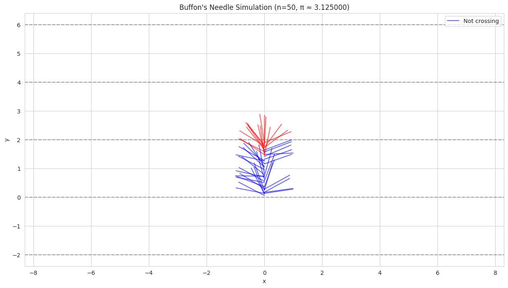
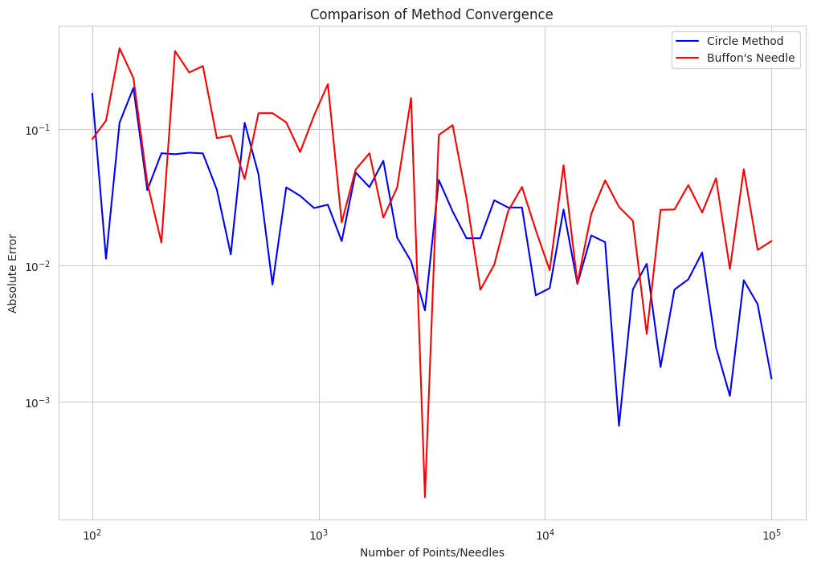
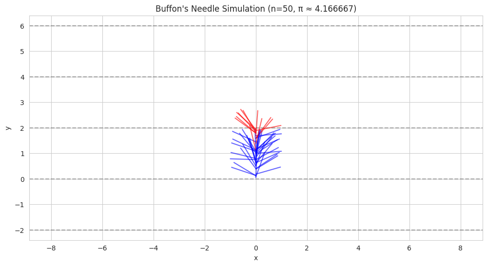
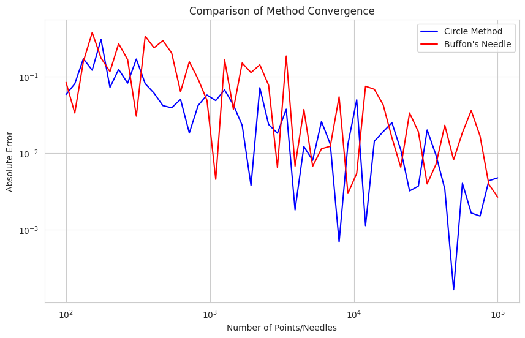

# Problem 2

Estimating π using Monte Carlo Methods

## 1. Circle-Based Monte Carlo Method

### 1.1 Theoretical Foundation

The circle-based Monte Carlo method for estimating π relies on the relationship between the area of a circle and its circumscribed square. For a unit circle (radius = 1) centered at the origin:

- Circle area: $A_c = \pi r^2 = \pi$
- Square area: $A_s = (2r)^2 = 4$

The ratio of these areas is:

$$ \frac{A_c}{A_s} = \frac{\pi}{4} $$

Therefore:

$$ \pi = 4 \cdot \frac{A_c}{A_s} \approx 4 \cdot \frac{\text{points inside circle}}{\text{total points}} $$

Let's implement this in Python:

```python
# Basic imports - no external dependencies
import numpy as np
import matplotlib.pyplot as plt

# Set random seed for reproducibility
np.random.seed(42)

def estimate_pi_circle(n_points):
    """
    Estimate π using the circle method.
    """
    # Generate random points
    x = np.random.uniform(-1, 1, n_points)
    y = np.random.uniform(-1, 1, n_points)
    
    # Calculate distances from origin
    distances = np.sqrt(x**2 + y**2)
    
    # Count points inside circle
    inside_circle = np.sum(distances <= 1)
    
    # Estimate pi
    pi_estimate = 4 * inside_circle / n_points
    
    return pi_estimate, x, y, distances

def plot_circle_method():
    """
    Create visualization for the circle method with different sample sizes.
    """
    sample_sizes = [100, 1000, 10000]
    fig, axes = plt.subplots(1, 3, figsize=(20, 6))
    
    for i, n in enumerate(sample_sizes):
        pi_est, x, y, distances = estimate_pi_circle(n)
        
        # Plot points
        inside = distances <= 1
        axes[i].scatter(x[inside], y[inside], c='blue', alpha=0.6, label='Inside')
        axes[i].scatter(x[~inside], y[~inside], c='red', alpha=0.6, label='Outside')
        
        # Draw circle
        theta = np.linspace(0, 2*np.pi, 100)
        axes[i].plot(np.cos(theta), np.sin(theta), 'k-')
        
        axes[i].set_aspect('equal')
        axes[i].grid(True)
        axes[i].set_title(f'n = {n}\nπ ≈ {pi_est:.6f}')
        axes[i].legend()
        axes[i].set_xlabel('x')
        axes[i].set_ylabel('y')

    plt.tight_layout()
    plt.show()

def simulate_buffon_needle(n_needles, L=1, D=2):
    """
    Simulate Buffon's needle experiment.
    """
    # Random positions and angles
    y = np.random.uniform(0, D, n_needles)
    theta = np.random.uniform(0, np.pi, n_needles)
    
    # Calculate needle endpoints
    y2 = y + L * np.sin(theta)
    
    # Count crossings
    crossings = np.sum(np.floor(y/D) != np.floor(y2/D))
    
    # Estimate pi
    pi_estimate = (2 * L * n_needles) / (D * crossings) if crossings > 0 else np.inf
    
    return pi_estimate, y, theta

def plot_buffon_needles(n_needles=50):
    """
    Visualize Buffon's needle experiment.
    """
    L, D = 1, 2
    pi_est, y, theta = simulate_buffon_needle(n_needles, L, D)
    
    # Calculate needle endpoints
    x = np.zeros(n_needles)
    y1 = y
    x2 = L * np.cos(theta)
    y2 = y + L * np.sin(theta)
    
    plt.figure(figsize=(15, 8))
    
    # Draw parallel lines
    for i in range(-1, 4):
        plt.axhline(y=i*D, color='k', linestyle='--', alpha=0.3)
    
    # Draw needles
    for i in range(n_needles):
        crosses = np.floor(y1[i]/D) != np.floor(y2[i]/D)
        color = 'red' if crosses else 'blue'
        plt.plot([x[i], x2[i]], [y1[i], y2[i]], color=color, alpha=0.6,
                label='Crossing' if crosses and i == 0 else 'Not crossing' if not crosses and i == 0 else "")
    
    plt.title(f'Buffon\'s Needle Simulation (n={n_needles}, π ≈ {pi_est:.6f})')
    plt.xlabel('x')
    plt.ylabel('y')
    plt.axis('equal')
    plt.grid(True)
    plt.legend()
    plt.show()

def compare_methods(max_points=5, steps=50):
    """
    Compare convergence of both methods.
    """
    points = np.logspace(2, max_points, steps, dtype=int)
    circle_errors = []
    buffon_errors = []
    
    for n in points:
        # Circle method
        pi_est_circle, _, _, _ = estimate_pi_circle(n)
        circle_errors.append(abs(pi_est_circle - np.pi))
        
        # Buffon's needle method
        pi_est_buffon, _, _ = simulate_buffon_needle(n)
        if pi_est_buffon != np.inf:
            buffon_errors.append(abs(pi_est_buffon - np.pi))
        else:
            buffon_errors.append(np.nan)
    
    plt.figure(figsize=(12, 8))
    plt.loglog(points, circle_errors, 'b-', label='Circle Method')
    plt.loglog(points, buffon_errors, 'r-', label='Buffon\'s Needle')
    plt.grid(True)
    plt.xlabel('Number of Points/Needles')
    plt.ylabel('Absolute Error')
    plt.title('Comparison of Method Convergence')
    plt.legend()
    plt.show()

# Run all simulations
print("Starting Monte Carlo π estimation...")

print("\nCircle Method Visualization:")
plot_circle_method()

print("\nBuffon's Needle Visualization:")
plot_buffon_needles()

print("\nMethod Comparison:")
compare_methods()

print("\nAll simulations completed!")
```






### 1.2 Convergence Analysis

Let's analyze how the estimate converges as we increase the number of points:

```python
def convergence_analysis(max_points, steps):
    points = np.logspace(2, max_points, steps, dtype=int)
    estimates = []
    errors = []
    
    for n in points:
        pi_est, _, _, _ = estimate_pi_circle(n)
        estimates.append(pi_est)
        errors.append(abs(pi_est - np.pi))
    
    return points, estimates, errors

# Perform analysis
points, estimates, errors = convergence_analysis(5, 50)

# Plot results
fig, (ax1, ax2) = plt.subplots(1, 2, figsize=(15, 5))

# Estimates plot
ax1.semilogx(points, estimates, 'b-', label='Estimate')
ax1.axhline(y=np.pi, color='r', linestyle='--', label='True π')
ax1.grid(True)
ax1.set_xlabel('Number of Points')
ax1.set_ylabel('π Estimate')
ax1.legend()
ax1.set_title('Convergence of π Estimate')

# Error plot
ax2.loglog(points, errors, 'g-')
ax2.grid(True)
ax2.set_xlabel('Number of Points')
ax2.set_ylabel('Absolute Error')
ax2.set_title('Error vs. Number of Points')
plt.tight_layout()
plt.show()
```


## 2. Buffon's Needle Method

### 2.1 Theoretical Foundation

Buffon's Needle problem involves dropping needles of length L onto a plane with parallel lines spaced distance D apart. The probability of a needle crossing a line is:

$$ P(\text{crossing}) = \frac{2L}{πD} $$

Therefore:

$$ π = \frac{2L}{D} \cdot \frac{\text{total drops}}{\text{crossings}} $$

Let's implement this method:

```python
def simulate_buffon_needle(n_needles, L=1, D=2):
    # Random positions and angles
    y = np.random.uniform(0, D, n_needles)
    theta = np.random.uniform(0, np.pi, n_needles)
    
    # Calculate needle endpoints
    y2 = y + L * np.sin(theta)
    
    # Count crossings
    crossings = np.sum(np.floor(y/D) != np.floor(y2/D))
    
    # Estimate pi
    pi_estimate = (2 * L * n_needles) / (D * crossings) if crossings > 0 else np.inf
    
    return pi_estimate, y, theta

def plot_buffon_needles(n_needles=50):
    L, D = 1, 2
    pi_est, y, theta = simulate_buffon_needle(n_needles, L, D)
    
    # Calculate needle endpoints
    x = np.zeros(n_needles)
    y1 = y
    x2 = L * np.cos(theta)
    y2 = y + L * np.sin(theta)
    
    # Plot
    plt.figure(figsize=(12, 6))
    
    # Draw parallel lines
    for i in range(-1, 4):
        plt.axhline(y=i*D, color='k', linestyle='--', alpha=0.3)
    
    # Draw needles
    for i in range(n_needles):
        crosses = np.floor(y1[i]/D) != np.floor(y2[i]/D)
        color = 'red' if crosses else 'blue'
        plt.plot([x[i], x2[i]], [y1[i], y2[i]], color=color, alpha=0.6)
    
    plt.title(f'Buffon\'s Needle Simulation (n={n_needles}, π ≈ {pi_est:.6f})')
    plt.xlabel('x')
    plt.ylabel('y')
    plt.axis('equal')
    plt.grid(True)
    plt.show()

# Visualize Buffon's needle simulation
plot_buffon_needles(50)
```



### 2.2 Convergence Analysis for Buffon's Needle

Let's analyze the convergence of the Buffon's needle method:

```python
def buffon_convergence_analysis(max_points, steps):
    points = np.logspace(2, max_points, steps, dtype=int)
    estimates = []
    errors = []
    
    for n in points:
        pi_est, _, _ = simulate_buffon_needle(n)
        if pi_est != np.inf:
            estimates.append(pi_est)
            errors.append(abs(pi_est - np.pi))
        else:
            estimates.append(np.nan)
            errors.append(np.nan)
    
    return points, estimates, errors

# Perform analysis
points, estimates, errors = buffon_convergence_analysis(5, 50)

# Plot results
fig, (ax1, ax2) = plt.subplots(1, 2, figsize=(15, 5))

# Estimates plot
ax1.semilogx(points, estimates, 'b-', label='Estimate')
ax1.axhline(y=np.pi, color='r', linestyle='--', label='True π')
ax1.grid(True)
ax1.set_xlabel('Number of Needles')
ax1.set_ylabel('π Estimate')
ax1.legend()
ax1.set_title('Convergence of Buffon\'s Needle Method')

# Error plot
ax2.loglog(points, errors, 'g-')
ax2.grid(True)
ax2.set_xlabel('Number of Needles')
ax2.set_ylabel('Absolute Error')
ax2.set_title('Error vs. Number of Needles')

plt.tight_layout()
plt.show()
```


## 3. Comparison of Methods

Let's compare the convergence rates of both methods:

```python
def compare_methods(max_points=5, steps=50):
    points = np.logspace(2, max_points, steps, dtype=int)
    circle_errors = []
    buffon_errors = []
    
    for n in points:
        # Circle method
        pi_est_circle, _, _, _ = estimate_pi_circle(n)
        circle_errors.append(abs(pi_est_circle - np.pi))
        
        # Buffon's needle method
        pi_est_buffon, _, _ = simulate_buffon_needle(n)
        if pi_est_buffon != np.inf:
            buffon_errors.append(abs(pi_est_buffon - np.pi))
        else:
            buffon_errors.append(np.nan)
    
    plt.figure(figsize=(10, 6))
    plt.loglog(points, circle_errors, 'b-', label='Circle Method')
    plt.loglog(points, buffon_errors, 'r-', label='Buffon\'s Needle')
    plt.grid(True)
    plt.xlabel('Number of Points/Needles')
    plt.ylabel('Absolute Error')
    plt.title('Comparison of Method Convergence')
    plt.legend()
    plt.show()

compare_methods()
```



## 4. Conclusions

1. **Convergence Rate**:
   - The circle method generally shows more stable convergence
   - Buffon's needle method has higher variance in its estimates

2. **Computational Efficiency**:
   - Circle method is simpler to implement and computationally lighter
   - Buffon's needle requires more complex geometric calculations

3. **Practical Considerations**:
   - Both methods demonstrate the power of Monte Carlo techniques
   - The circle method is more suitable for educational purposes
   - Buffon's needle provides an interesting historical and geometric perspective

## 5. Applications

- Random number generation testing
- Introduction to Monte Carlo methods
- Teaching probability and geometric concepts
- Demonstration of law of large numbers

The Monte Carlo estimation of π serves as an excellent introduction to computational methods in physics and mathematics, demonstrating how random sampling can be used to solve deterministic problems.